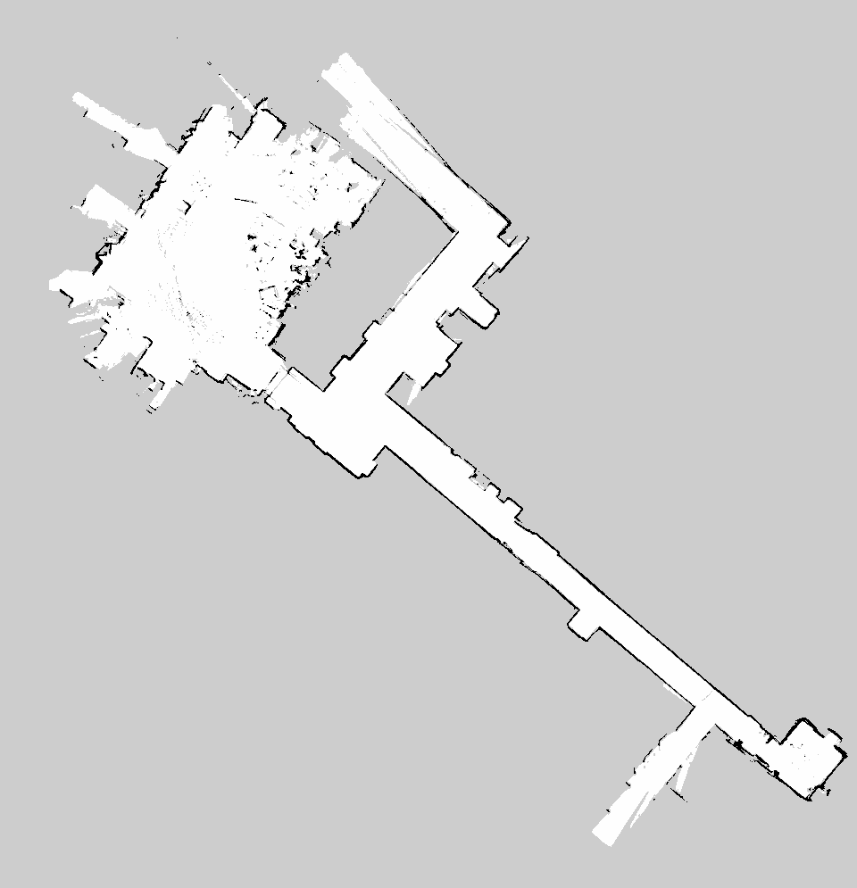

# Library_bot — Autonomous Mobile Robot Platform

A complete ROS 2 autonomy stack for a differential-drive robot equipped with a **SICK PicoScan LiDAR**, **XSens IMU**, and wheel encoders. The pipeline covers everything from raw sensor bringup through SLAM mapping, AMCL localization, PRM-based path planning, and closed-loop waypoint following.

---


> **Autonomous Mode** (Adaptive Monte Carlo localization):

> 

> **Raw EKF odometry** (no SLAM, no localization) — encoder + IMU fusion only:
> 

---

#### Map — Levine Hall 4th Floor, University of Pennsylvania (GRASP Lab)



> Map generated using SICK PicoScan LiDAR. Testing environment: Levine Hall 4th Floor, University of Pennsylvania.

## Repository Structure

```
flex_bot/src/
├── flex_bot_bringup/       # Launch files, maps, sensor + EKF bringup
├── flex_bot_odometry/      # Wheel encoder odometry
├── flex_bot_teleop/        # UDP bridge + joystick/keyboard teleop
├── flex_bot_controller/    # PRM builder, A* planner, waypoint controller
├── particle_filter/        # Custom particle filter (localization)
└── wall_follow/            # Wall-following demo node
```

---

## Prerequisites

- ROS 2 Jazzy (or Humble)
- `robot_localization` — EKF state estimation
- `slam_toolbox` — 2D SLAM
- `nav2_map_server`, `nav2_amcl`, `nav2_lifecycle_manager` — localization stack
- `sick_scan_xd` — SICK PicoScan driver
- `nanoflann` — header-only KD-tree library for PRM

```bash
sudo apt install libnanoflann-dev
```

**Network configuration:**
| Device | IP |
|---|---|
| IMX7 (robot computer) | `192.168.0.2` |
| Companion computer | `192.168.0.20` |

---

## Build

```bash
cd ~/flex_bot
colcon build --symlink-install
source install/setup.bash
```

---

## Package Overview

### `flex_bot_teleop`

Bidirectional UDP communication with the IMX7 embedded controller.

- `udp_bridge_node` — bridges ROS 2 topics to/from UDP packets
- `teleop_node` — converts joystick or keyboard input into velocity commands

Configuration: `config/flex_bot_udp.yaml`, `config/teleop.yaml`

```bash
ros2 launch flex_bot_teleop flex_bot.launch.py
```

---

### `flex_bot_odometry`

Wheel odometry from encoder feedback received over UDP.

Publishes `odom → base_link` as an odometry source (fused by EKF downstream).

Configuration: `config/wheel_odom.yaml`

```bash
ros2 launch flex_bot_odometry wheel_odom.launch.py

# Optional: visualize odometry path
ros2 run flex_bot_odometry odom_to_path.py
```

---

### `flex_bot_bringup`

Central bringup package. Manages sensor launch, static TFs, EKF, SLAM, and localization.

#### State Estimation (EKF)

Fuses wheel odometry + IMU via `robot_localization` to produce a stable `odom → base_link` transform.

Configuration: `config/ekf_imu.yaml`

Key settings:
- `two_d_mode: true` — for ground robots
- Fuses yaw and yaw-rate from IMU; wheel vx and vyaw from encoders

> The `demo.gif` at the top shows the quality of odometry achievable from EKF alone (encoder + IMU), without any SLAM or localization corrections.

```bash
ros2 launch flex_bot_bringup bringup_state_estimation.launch.py
```

#### SLAM Mapping

Builds a 2D occupancy grid map using `slam_toolbox` while driving the robot around.

```bash
ros2 launch flex_bot_bringup full_bringup_mapping.launch.py
```

Save the map when done:
```bash
ros2 run nav2_map_server map_saver_cli -f ~/flex_bot/src/flex_bot_bringup/maps/my_map
```

#### Localization

Loads a saved map and runs AMCL to localize the robot within it.

```bash
ros2 launch flex_bot_bringup full_bringup_localization.launch.py
```

After launching, set the initial pose in RViz using **"2D Pose Estimate"**.

---

### `flex_bot_controller`

Autonomous navigation stack: PRM roadmap construction → A* path planning → waypoint following.

#### Nodes

| Node | Description |
|---|---|
| `prm_builder` | Subscribes to `/map`, inflates obstacles, samples random free-space nodes, builds a probabilistic roadmap, publishes `/prm/nodes` + `/prm/adjacency` + `/map_inflated` |
| `astar_search` | Subscribes to PRM graph + `/goal_pose`, reads robot pose from TF (`map→base_link`), runs A* over the roadmap, publishes `/astar/path` |
| `waypoint_controller` | Follows `/astar/path` via pure-pursuit, reads pose from `/amcl_pose`, publishes `Float64` to `/left_wheel/cmd_vel` and `/right_wheel/cmd_vel` |

#### Differential Drive IK

```
omega_right = (v + omega * L/2) / r
omega_left  = (v - omega * L/2) / r
```

Where `L` = wheel base (track width), `r` = wheel radius. Both outputs are scaled proportionally if either exceeds `max_wheel_rads`.

#### Configuration: `config/controller_params.yaml`

Key parameters to tune for your robot:

```yaml
prm_builder:
  inflation_radius_m: 0.30    # robot half-width + safety margin

waypoint_controller:
  wheel_radius: 0.076         # measure from axle to ground
  wheel_base: 0.30            # left-to-right wheel contact distance
  max_wheel_rads: 3.0         # hardware speed limit
  linear_speed: 0.25          # m/s cruise speed
  lookahead: 0.6              # pure-pursuit look-ahead (larger = smoother)
  heading_kp: 1.5             # angular P gain
```

```bash
ros2 launch flex_bot_controller controller.launch.py
```

---

## TF Chain

```
map → odom → base_link → laser_1
              └→ xsens_imu  (static)
```

| Transform | Source |
|---|---|
| `map → odom` | AMCL |
| `odom → base_link` | EKF (`robot_localization`) |
| `base_link → laser_1` | Static TF |
| `base_link → xsens_imu` | Static TF |

---

## Full Pipeline — Launch Order

### Phase 1: Mapping

```bash
# Terminal 1 — full mapping bringup (sensors + EKF + SLAM + RViz)
ros2 launch flex_bot_bringup full_bringup_mapping.launch.py

# Terminal 2 — teleop to drive the robot
ros2 launch flex_bot_teleop flex_bot.launch.py
```

Drive the robot around the environment. When the map looks complete:

```bash
ros2 run nav2_map_server map_saver_cli -f ~/flex_bot/src/flex_bot_bringup/maps/my_map
```

---

### Phase 2: Localization

```bash
# Terminal 1 — localization stack (map_server + AMCL + EKF + RViz)
ros2 launch flex_bot_bringup full_bringup_localization.launch.py
```

In RViz:
1. Set **Fixed Frame** → `map`
2. Click **"2D Pose Estimate"** → click where the robot is on the map

Verify localization is working:
```bash
ros2 topic hz /amcl_pose
ros2 run tf2_ros tf2_echo map odom
```

---

### Phase 3: Autonomous Navigation

```bash
# Terminal 1 — localization (must be running first)
ros2 launch flex_bot_bringup full_bringup_localization.launch.py

# Terminal 2 — planning + control
ros2 launch flex_bot_controller controller.launch.py
```

In RViz:
1. Click **"2D Goal Pose"** → click anywhere on free space in the map
2. The robot will plan a path and start moving

#### RViz displays to add:

| Display | Topic | Notes |
|---|---|---|
| Map | `/map` | Base occupancy grid |
| Map | `/map_inflated` | Inflated obstacles used by PRM |
| Marker | `/prm/edges` | Cyan — roadmap graph |
| Marker | `/prm/nodes` | Red dots — PRM sample nodes |
| Path | `/astar/path` | Planned path |
| Marker | `/controller/target` | Orange sphere — current look-ahead point |

> **Note:** For all Map displays set Reliability Policy → `Reliable` and Durability Policy → `Transient Local` in the RViz topic settings.

---

## Diagnostics

```bash
# Check all nodes are running
ros2 node list

# Verify TF chain is complete
ros2 run tf2_tools view_frames

# Check AMCL is localizing
ros2 topic hz /amcl_pose

# Check wheel commands are going out
ros2 topic echo /left_wheel/cmd_vel
ros2 topic echo /right_wheel/cmd_vel

# Check path is being planned
ros2 topic hz /astar/path

# Check map is publishing
ros2 topic hz /map
```

---

## Static TF Setup

Sensor mounting offsets relative to `base_link`. Replace zeros with measured values.

These are managed automatically via:
```bash
ros2 launch flex_bot_bringup static_tfs.launch.py
```

---

## IMX7 Counterpart

Low-level motor control, encoder reading, and UDP packet formatting runs on the IMX7 embedded controller. See the `imx7` branch for that firmware.

UDP IP/port settings in `flex_bot_teleop/config/flex_bot_udp.yaml` must match the IMX7 configuration.
