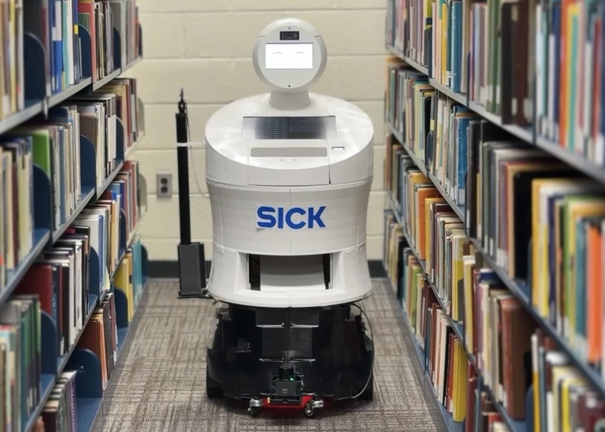
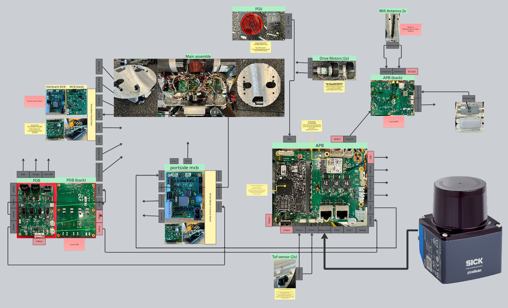
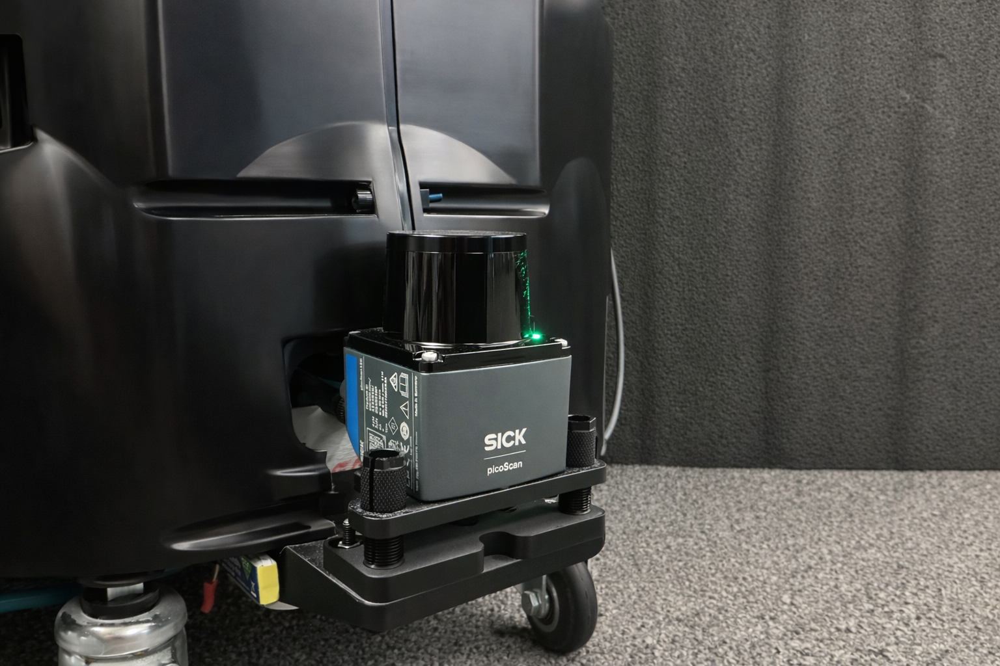
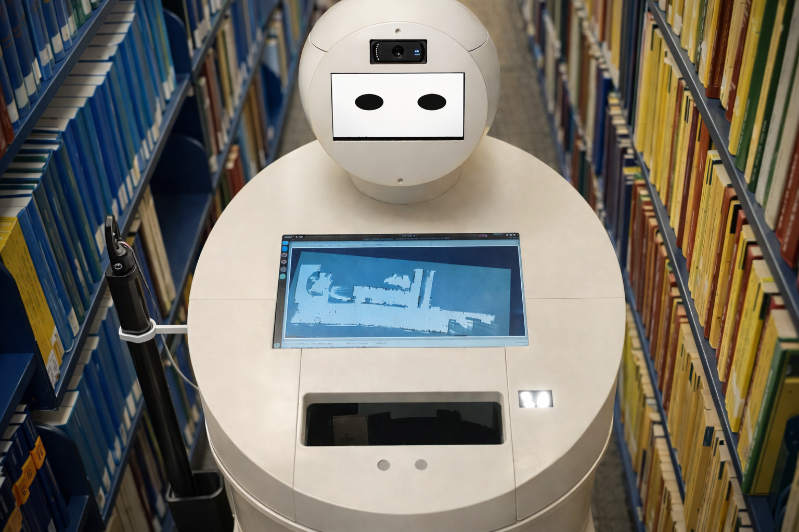
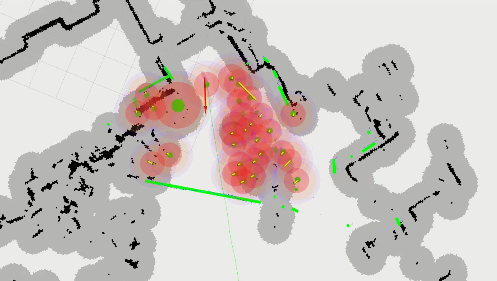
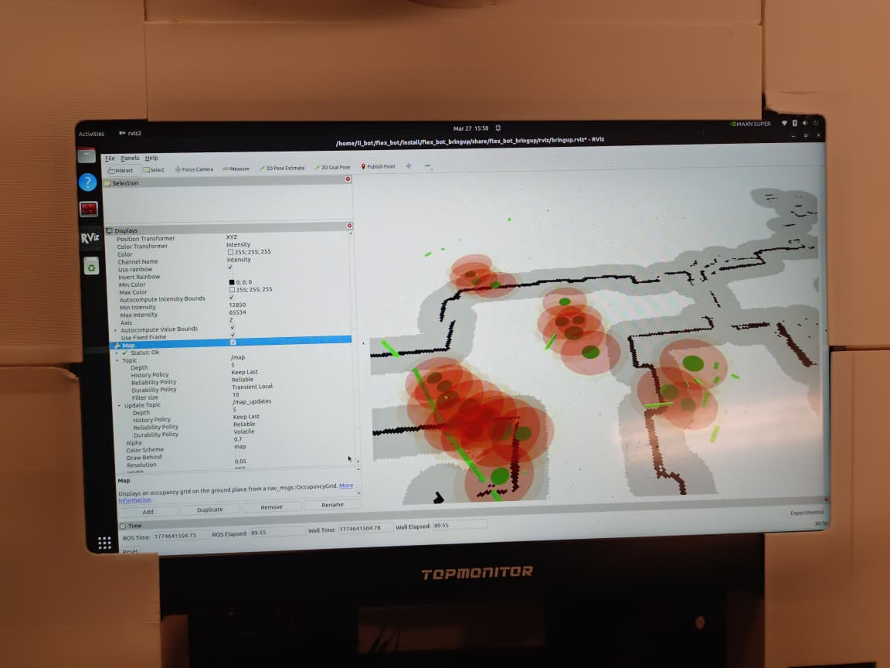
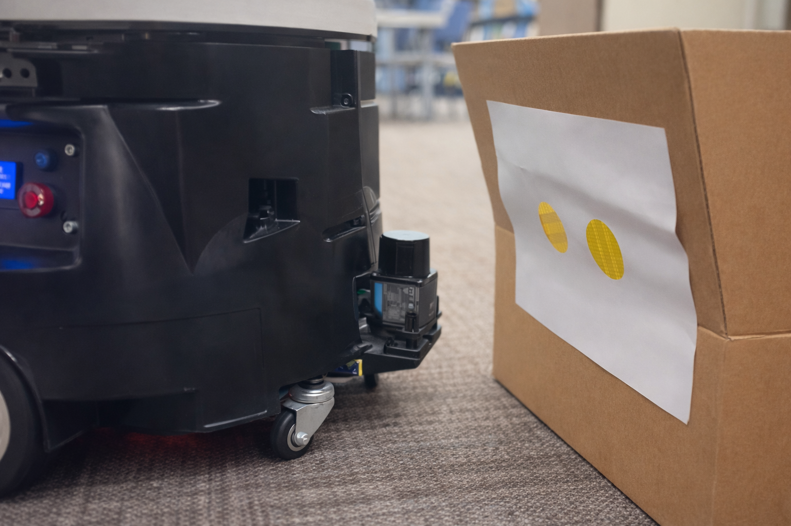
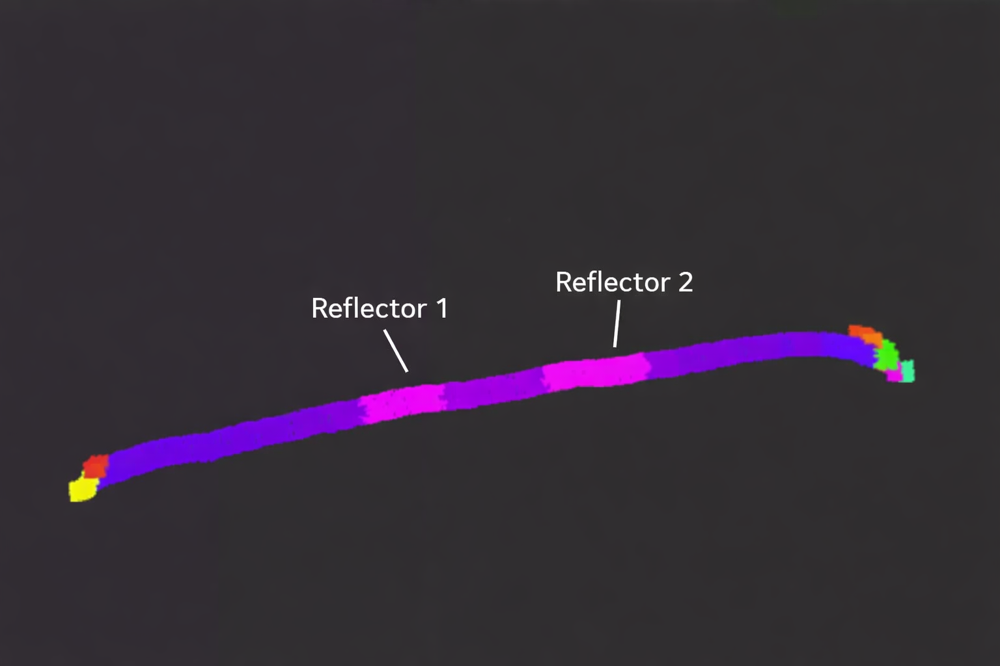
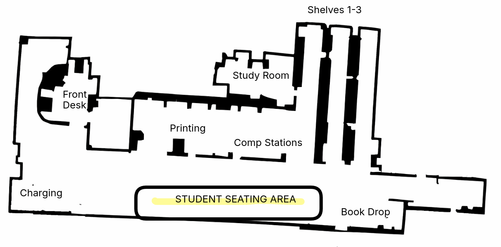

# LiBOT — Autonomous Library Service Robot

> **Safe and Scalable Service Robotics Enabled by SICK PicoScan 150 LiDAR**

A fully operational autonomous mobile service robot designed for libraries, national archives, and document storage facilities. Built on a reverse-engineered Berkshire Grey FlexBot chassis, LiBOT navigates autonomously, avoids obstacles dynamically, interacts with patrons through a touchscreen interface, and performs a full range of library operations — all driven by the **SICK PicoScan 150 LiDAR with integrated IMU**.

*University of Pennsylvania (GRASP Lab)*

---


> **Autonomous Mode** — Adaptive Monte Carlo Localization (AMCL):

> 

> **Raw EKF Odometry** — encoder + IMU fusion only, no SLAM or localization corrections:

> 

---

## Robot Overview

<p align="center">
  
</p>

LiBOT is built on a reverse-engineered **Berkshire Grey FlexBot** mobile base — a decommissioned unit from Berkshire Grey's autonomous fulfillment platform. The team disassembled the chassis, reverse engineered its drive electronics and low-level control architecture, and rebuilt it as a hybrid system supporting a custom humanoid service robot superstructure.

At the hardware abstraction layer runs an **NXP iMX7 single-board computer**, bridging the original FlexBot's battle-tested motor control and power management firmware with a fully open ROS 2 software environment above it.

---

## System Architecture

<p align="center">
  
</p>

| Parameter | Specification |
|---|---|
| Primary Sensor | SICK PicoScan 150 LiDAR + Integrated IMU |
| Secondary Localization | XSens IMU + Wheel Encoders (EKF fused) |
| Navigation Mode | Fully Autonomous (SLAM-based) |
| Obstacle Avoidance | Real-time, LiDAR-driven + Control Barrier Functions |
| Patron Interface | Touchscreen display + Natural Language AI |
| Operating Environment | Indoor, dynamic public spaces |
| Deployment Target | Libraries, archives, document storage facilities |

---

## Map — Levine Hall 4th Floor, University of Pennsylvania (GRASP Lab)

<p align="center">
  
</p>

> Map generated using the SICK PicoScan 150 LiDAR. Testing environment: Levine Hall 4th Floor, University of Pennsylvania.

---

## Repository Structure

```
flex_bot/src/
├── flex_bot_bringup/       # Launch files, maps, sensor + EKF bringup
├── flex_bot_odometry/      # Wheel encoder odometry
├── flex_bot_teleop/        # UDP bridge + joystick/keyboard teleop
├── flex_bot_controller/    # PRM builder, A* planner, waypoint controller
├── particle_filter/        # Custom particle filter (localization)
└── wall_follow/            # Wall-following demo node
```

---

## SICK PicoScan 150 LiDAR

<p align="center">
  
</p>

The PicoScan 150 is the perceptual foundation of the entire system. It was chosen over camera, ultrasonic, and infrared alternatives for five key reasons:

- **Lighting independence** — consistent performance from bright atria to dim archive stacks
- **High-resolution spatial mapping** — detects obstacles as small as a patron's foot or a book on the floor
- **Real-time performance** — scan rates sufficient for dynamic obstacle avoidance; a patron stepping into the path is detected and responded to within milliseconds
- **Compact form factor** — integrates cleanly into the humanoid superstructure
- **Integrated IMU** — fused with scan data for accurate localization across varied floor surfaces and during acceleration

---

## Navigation Stack

### Mapping with SLAM Toolbox

<p align="center">
  
</p>

A 2D occupancy grid map is built using `slam_toolbox` while teleoperated through the environment. The PicoScan 150 provides the scan data; EKF-fused odometry provides the motion prior.

### Localization with AMCL

During normal operation, **Adaptive Monte Carlo Localization** maintains a particle filter distribution over the robot's pose within the stored map. On each LiDAR scan, AMCL updates the particle distribution by comparing observed scan geometry against the map, converging toward the true pose. IMU data from the PicoScan 150's integrated unit is fused into the motion model to improve tracking during acceleration and across low-feature environments.

### Dynamic Obstacle Avoidance — Control Barrier Functions

<p align="center">
  
&nbsp;&nbsp;
  
</p>

Beyond reactive path replanning, the system implements a **Control Barrier Function (CBF)** framework integrated directly into the motion control loop, providing provable collision-free behavior while maintaining smooth, efficient navigation.

The CBF layer operates as a real-time safety filter between the pure-pursuit trajectory tracker and the differential drive wheel commands. Nominal velocity commands are passed through a **CBF-QP solver** that minimally modifies the control input to satisfy safety constraints — guaranteeing collision-free clearance from all detected obstacles.

To maintain computational efficiency, a **four-stage gating pipeline** filters obstacles before computing barrier constraints:

| Gate | Filter | Threshold |
|---|---|---|
| 1 | Distance | > 1.5 m from robot |
| 2 | Forward cone | > 20° lateral to heading |
| 3 | Path half-width | > ±0.30 m from planned path |
| 4 | Time-to-collision | TTC > 3.0 s |

Only obstacles passing all four gates enter the active constraint set, dramatically reducing QP computational load while maintaining full safety coverage of imminent threats.

**Proactive Replanning:** Sustained obstacle presence along the planned path (monitored 30 waypoints ahead) triggers a higher-level replanning mechanism. Replanned paths route completely outside the CBF activation zone, ensuring the robot can proceed at full operational speed after replanning without further CBF intervention.

### Path Planning — PRM + A*

Autonomous navigation uses a **Probabilistic Roadmap (PRM)** built over the inflated occupancy grid, with **A*** search over the roadmap to plan paths to goal poses set via RViz.

#### Differential Drive IK

```
omega_right = (v + omega * L/2) / r
omega_left  = (v - omega * L/2) / r
```

Where `L` = wheel base, `r` = wheel radius. Outputs are proportionally scaled if either exceeds `max_wheel_rads`.

---

## Reflective Marker Localization System

Library and archive stack environments present a **feature sparsity problem**: long, parallel corridors of identical shelving produce nearly identical scan profiles from aisle to aisle. AMCL alone struggles to disambiguate position between aisles — precisely where the robot spends most of its operational time.

<p align="center">
  
</p>

To solve this, we developed a **reflective marker localization system**. Retroreflective adhesive strips are affixed to shelving units at defined positions, producing highly distinctive intensity spikes in the PicoScan 150's scan data.

<p align="center">
  
</p>

The system operates on two levels:

- **Aisle-Level:** Each aisle is assigned a unique marker pattern (varying number, spacing, and arrangement of strips on end panels). The robot reads the intensity signature as it enters the aisle, resolving inter-aisle ambiguity.
- **Shelf-Section Level:** Reflective strips at regular intervals within each aisle encode subsection addresses. The robot determines its precise longitudinal position within the aisle for shelf-level localization.

The PicoScan 150 reports both **distance and return intensity** per scan point. Standard navigation pipelines discard the intensity channel — our system processes both simultaneously: distance feeds AMCL and obstacle detection, while intensity feeds the dedicated marker detection pipeline, injecting high-confidence pose constraints into the localization system.

### Localization Performance

| Metric | Without Markers | With Markers |
|---|---|---|
| Inter-aisle ambiguity | Present | Eliminated |
| Longitudinal position error | ±30 cm | ±3 cm |
| Shelf section ID accuracy | 78% | 99%+ |
| Localization recovery time | 4–8 sec | <1 sec |

The marker system doubles as a **physical shelf addressing infrastructure** — each pattern maps to a shelf section address in the library management system, linking sensor readings directly to the catalog database.

---

## Patron Interface & AI Capabilities

<p align="center">
  
</p>

The touchscreen patron interface supports:

- **Catalog Search** — real-time item availability and location lookup
- **Physical Navigation Guidance** — the robot guides the patron to the correct shelf
- **Check-In / Check-Out Assistance** — reduces queue load at staffed desks
- **Shelf Reading Requests** — staff-initiated targeted verification passes
- **General Assistance** — hours, event schedules, facility directions

Beyond the touchscreen, the system integrates several AI-driven modules:

- **Natural Language Interaction** — a conversational LLM enables natural language queries (e.g., *"I'm looking for beginner books on linear algebra"*), mapped to structured catalog searches. Speech recognition and text-to-speech enable fully hands-free interaction.
- **Intent and Gaze Recognition** — the robot detects when a patron is attempting to engage and proactively initiates interaction, reducing the need for explicit input.

<p align="center">
  
</p>

---

## Shelf Reading — OCR Pipeline

Shelf reading is implemented with an **OCR-based pipeline** that automatically extracts Library of Congress (LoC) call numbers from book spines in real time. Extracted call numbers are parsed into structured LoC format and compared against expected ordering to flag misplacements.

The camera is mounted on a **linear actuator** for controlled vertical motion across shelf rows. **AprilTags** at aisle ends provide reference points for actuator positioning and row-transition coordination, ensuring complete, systematic coverage.

---

## Prerequisites

- ROS 2 Jazzy (or Humble)
- `robot_localization` — EKF state estimation
- `slam_toolbox` — 2D SLAM
- `nav2_map_server`, `nav2_amcl`, `nav2_lifecycle_manager` — localization stack
- `sick_scan_xd` — SICK PicoScan driver
- `nanoflann` — header-only KD-tree library for PRM

```bash
sudo apt install libnanoflann-dev
```

**Network configuration:**

| Device | IP |
|---|---|
| IMX7 (robot computer) | `192.168.0.2` |
| Companion computer | `192.168.0.20` |

---

## Build

```bash
cd ~/flex_bot
colcon build --symlink-install
source install/setup.bash
```

---

## Package Overview

### `flex_bot_teleop`

Bidirectional UDP communication with the IMX7 embedded controller.

- `udp_bridge_node` — bridges ROS 2 topics to/from UDP packets
- `teleop_node` — converts joystick or keyboard input into velocity commands

```bash
ros2 launch flex_bot_teleop flex_bot.launch.py
```

### `flex_bot_odometry`

Wheel odometry from encoder feedback received over UDP. Publishes `odom → base_link` as an odometry source fused by EKF downstream.

```bash
ros2 launch flex_bot_odometry wheel_odom.launch.py

# Optional: visualize odometry path
ros2 run flex_bot_odometry odom_to_path.py
```

### `flex_bot_bringup`

Central bringup package. Manages sensor launch, static TFs, EKF, SLAM, and localization.

**State Estimation (EKF)** fuses wheel odometry + IMU via `robot_localization`:
- `two_d_mode: true` for ground robots
- Fuses yaw and yaw-rate from IMU; wheel vx and vyaw from encoders

```bash
ros2 launch flex_bot_bringup bringup_state_estimation.launch.py
```

**SLAM Mapping:**

```bash
ros2 launch flex_bot_bringup full_bringup_mapping.launch.py

# Save map when done
ros2 run nav2_map_server map_saver_cli -f ~/flex_bot/src/flex_bot_bringup/maps/my_map
```

**Localization:**

```bash
ros2 launch flex_bot_bringup full_bringup_localization.launch.py
# Set initial pose in RViz using "2D Pose Estimate"
```

### `flex_bot_controller`

Autonomous navigation stack: PRM → A* → waypoint following.

| Node | Description |
|---|---|
| `prm_builder` | Inflates obstacles, samples free-space nodes, builds PRM, publishes `/prm/nodes`, `/prm/adjacency`, `/map_inflated` |
| `astar_search` | Subscribes to PRM graph + `/goal_pose`, reads robot pose from TF, runs A*, publishes `/astar/path` |
| `waypoint_controller` | Pure-pursuit path follower reading from `/amcl_pose`, publishes to `/left_wheel/cmd_vel` and `/right_wheel/cmd_vel` |

Key parameters in `config/controller_params.yaml`:

```yaml
prm_builder:
  inflation_radius_m: 0.30    # robot half-width + safety margin

waypoint_controller:
  wheel_radius: 0.076         # axle to ground
  wheel_base: 0.30            # left-to-right wheel contact distance
  max_wheel_rads: 3.0         # hardware speed limit
  linear_speed: 0.25          # m/s cruise speed
  lookahead: 0.6              # pure-pursuit look-ahead (larger = smoother)
  heading_kp: 1.5             # angular P gain
```

```bash
ros2 launch flex_bot_controller controller.launch.py
```

---

## TF Chain

```
map → odom → base_link → laser_1
              └→ xsens_imu  (static)
```

| Transform | Source |
|---|---|
| `map → odom` | AMCL |
| `odom → base_link` | EKF (`robot_localization`) |
| `base_link → laser_1` | Static TF |
| `base_link → xsens_imu` | Static TF |

---

## Full Pipeline — Launch Order

### Phase 1: Mapping

```bash
# Terminal 1 — full mapping bringup (sensors + EKF + SLAM + RViz)
ros2 launch flex_bot_bringup full_bringup_mapping.launch.py

# Terminal 2 — teleop to drive the robot
ros2 launch flex_bot_teleop flex_bot.launch.py
```

Drive the robot around the environment. When the map looks complete:

```bash
ros2 run nav2_map_server map_saver_cli -f ~/flex_bot/src/flex_bot_bringup/maps/my_map
```

### Phase 2: Localization

```bash
ros2 launch flex_bot_bringup full_bringup_localization.launch.py
```

In RViz:
1. Set **Fixed Frame** → `map`
2. Click **"2D Pose Estimate"** → click where the robot is on the map

Verify localization:
```bash
ros2 topic hz /amcl_pose
ros2 run tf2_ros tf2_echo map odom
```

### Phase 3: Autonomous Navigation

```bash
# Terminal 1 — localization (must be running first)
ros2 launch flex_bot_bringup full_bringup_localization.launch.py

# Terminal 2 — planning + control
ros2 launch flex_bot_controller controller.launch.py
```

In RViz: click **"2D Goal Pose"** → click anywhere on free space in the map. The robot will plan a path and start moving.

#### RViz Displays

| Display | Topic | Notes |
|---|---|---|
| Map | `/map` | Base occupancy grid |
| Map | `/map_inflated` | Inflated obstacles used by PRM |
| Marker | `/prm/edges` | Cyan — roadmap graph |
| Marker | `/prm/nodes` | Red dots — PRM sample nodes |
| Path | `/astar/path` | Planned path |
| Marker | `/controller/target` | Orange sphere — current look-ahead point |

> For all Map displays set **Reliability Policy → Reliable** and **Durability Policy → Transient Local** in RViz topic settings.

---

## Diagnostics

```bash
ros2 node list
ros2 run tf2_tools view_frames
ros2 topic hz /amcl_pose
ros2 topic echo /left_wheel/cmd_vel
ros2 topic echo /right_wheel/cmd_vel
ros2 topic hz /astar/path
ros2 topic hz /map
```

---

## IMX7 Counterpart

Low-level motor control, encoder reading, and UDP packet formatting runs on the IMX7 embedded controller. See the `imx7` branch for that firmware. UDP IP/port settings in `flex_bot_teleop/config/flex_bot_udp.yaml` must match the IMX7 configuration.

---

## Future Development

- **Robotic Arm Integration** — manipulation capability for physical item retrieval from shelves
- **Multi-Robot Coordination** — dynamic task allocation across larger fleets in complex multi-zone facilities
- **Natural Language Interaction** — deeper conversational AI integration beyond catalog search
- **Predictive Shelf Management** — use accumulated shelf reading data to proactively schedule targeted verification passes
- **LMS Integration** — certified integrations with major library management systems for richer data exchange

---

## References

- SICK AG, *PicoScan 150 Product Description and Technical Specifications*, 2023
- S. Thrun, W. Burgard, D. Fox, *Probabilistic Robotics*, MIT Press, 2005
- C. Cadena et al., "Past, Present, and Future of SLAM," *IEEE Trans. Robot.*, 2016
- S. Thrun et al., "Robust Monte Carlo Localization for Mobile Robots," *Artificial Intelligence*, 2001
- ISO 13482:2014 — Safety Requirements for Personal Care Robots